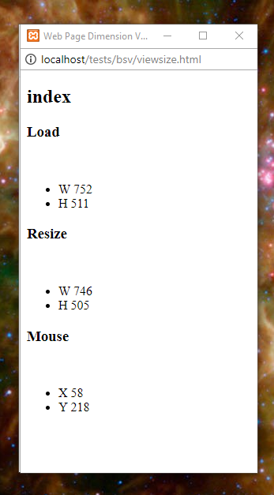

# Web Page Size/Dimension Viewer

A utility that remotely displays the viewport size of a browser window.

# Overview

This tool will allow you to have a *live* view of the width and height of a separate browser window. It utilizes the browser's *local storage* and *storage events* to communicate changes in the view port size to a separate instance of the browser.

## History

I was working on some responsive web pages adding some *media breaks* in order to fine tune the responsiveness. And I needed to see the width of the of the viewing area to get the numbers I needed.

My method was to resize the window until the layout of the elements became undesirable, stop resizing and note the current width of the view area.

I use Chrome for development so I searched the extensions for one that would provide *live* reporting of at least the width. But nothing worked as I needed. So I tried to think of ways to use JavaScript to convey data between tabs or browser instances. I knew that *local storage* is shared between pages from the same domain. But polling for data updates wasn't something I wanted to use here.

After some web searches and some time I found out about *local storage events*.

# Running the Viewer

**Requirements :**

The files must reside on the same *server*. And accessing them directly from where they're stored on your PC will not work.

## Steps

**1**) Copy all three HTML files to a location in your server's *public HTML* folder. Remember that one of the files is named `index.html` so don't over write an existing file.

**2**) Open the `index.html` file in your browser and follow the instructions found there.

## Results

The viewer will display the following - 

* The name of the page. For example if your getting data from `index.html` **`index`** will be seen.
* The width and the height of the page when it was first loaded.
* The width and the height of the page as it's being resized. This will update as the page is resized.
* The current mouse position over the viewed page.

  

# Future Development

This was a fun and useful project! And it got me to thinking about how else I could use local storage events. So after a few minutes I came up with what follows...

## Semi-Remote Logger

I might try replacing `console.log()` calls with something that will send the output to local storage. And then a remote viewer would display the output.

I will likely need to *queue* up messages for situations where multiple calls to `console.log()` are made in quick succession. And I'll use *session storage* instead of local to be sure the queue is deleted when the browser windows are closed.

### Miscellaneous Design Details

* The viewer will set a flag in *storage* that indicates that it's present and ready. The remote-enabled page will check the flag and if not present then nothing will be saved to storage.
* *TBD*

## Semi-Remote CLI

I can't really say how useful or practical it would actually be to have a CLI for a web page. But it might have its uses. For example - 

* For debugging & testing -
    * Alter run-time settings
    * Pause/resume execution
    * A learning tool

# Recommended Reading

* [Using the Web Storage API](https://developer.mozilla.org/en-US/docs/Web/API/Web_Storage_API/Using_the_Web_Storage_API)
* [storage - Event reference | MDN](https://developer.mozilla.org/en-US/docs/Web/Events/storage)
* [HTML5 Local Storage](http://tutorials.jenkov.com/html5/local-storage.html)

