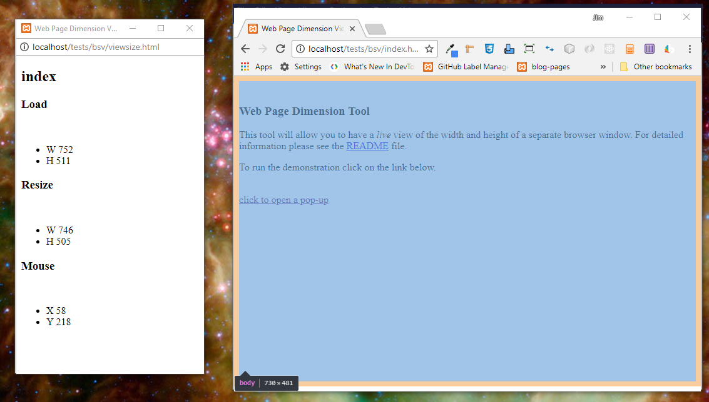
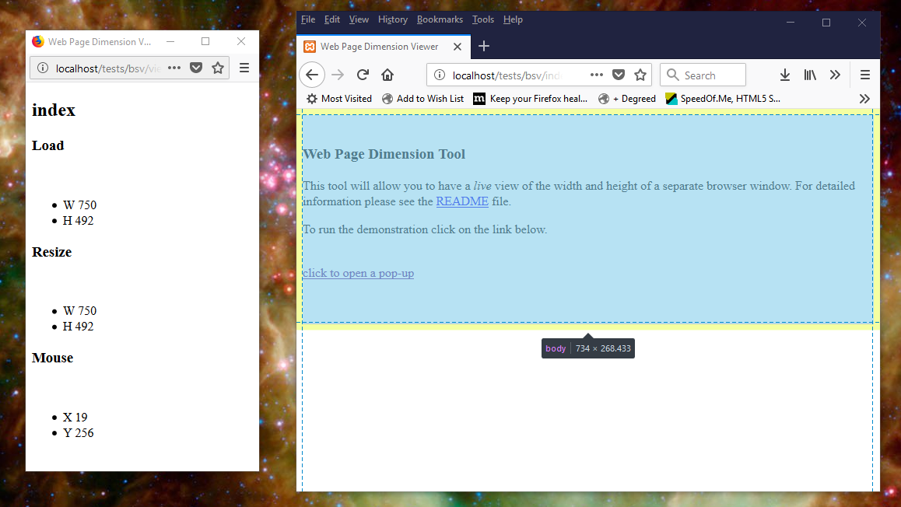

# Web Page Size/Dimension/Mouse Position Viewer

A utility that remotely displays the viewport size of a browser window and the mouse position within the viewport.

# Overview

This tool will allow you to have a *live* view of the width and height of a separate browser window. It utilizes the browser's *local storage* and *storage events* to communicate changes in the view port size to a separate instance of the browser.

## History

I was working on some responsive web pages adding some *media breaks* in order to fine tune the responsiveness. And I needed to see the width of the of the viewing area to get the numbers I needed.

My method was to resize the window until the layout of the elements became undesirable, stop resizing and note the current width of the view area.

I use Chrome for development so I searched the extensions for one that would provide *live* reporting of at least the width. But nothing worked as I needed. So I tried to think of ways to use JavaScript to convey data between tabs or browser instances. I knew that *local storage* is shared between pages from the same domain. But polling for data updates wasn't something I wanted to use here.

After some web searches and some time I found out about *local storage events*. And what you see here is the result of what I learned.

# Running the Viewer

**Requirements :**

If using **Chrome**, **IE**, or **Edge** :

The files must reside on the same *server*. And accessing them directly from where they're stored on your PC will not work. For example `file:///C:/path/to/index.html` will not work. But `http://localhost/path/to/index.html` will work.

If using **FireFox** :

You can either host the files or load the page via `file:///C:/path/to/index.html`. Either method will work. 

## Steps

**1**) Create a folder called `temp` in your server's *public HTML* folder.

**2**) Copy both of HTML files and the `assets/js/` path and its file(s) to `temp`.

**3**) Open the `index.html` file in your browser and follow the instructions found there.

## Results

The viewer will display the following - 

* The name of the page. For example if your getting data from `index.html` then **`index`** will be seen at the top of the page.
* The width and the height of the page when it was first loaded.
* The width and the height of the page, the values will be updated as it's being resized.
* The current mouse position over the viewed page.

<p align="center">
  
</p>

## Browser Behavior

Except for FireFox all of the other browsers I used behave as expected in regards to reporting the viewport size and mouse position. The only discrepancy I saw was the mouse position. When Firefox was used the mouse position would stop reporting below a fixed "line" within the browser viewport. Where other browsers would report the position across the entire viewport.

The cause of the difference in behavior is determined by the particular browser's *user agent stylesheet*. This is the CSS styling that is used when the page has no CSS of its own. The following images illustrate the differences, the highlighted areas represent the document *body*.

**Chrome :**<br>
<p align="center">
  
</p>

**FireFox :**<br>
<p align="center">
  
</p>

## Real-World Usage

The following shows the *minimum* changes that need to be made to any page where you need to view the size and mouse position - 

```html
<html>
<head>
    <meta charset="UTF-8">
</head>
<body onresize="showsize()">
    <div id="viewsize-link">
    </div>
    <script src="https://cdnjs.cloudflare.com/ajax/libs/jquery/3.1.1/jquery.min.js"></script>
    <script src="assets/js/viewsize.js"></script>
</body>
</html>
```

# Future Development

This was a fun and useful project! And it got me to thinking about how else I could use local storage events. So after a few minutes I came up with what follows...

## Appearance Improvements

The look of the viewer is a bit rough, but it is just a *tool* after all. However, when I've got the time I'll work on the appearance and pretty it up a bit. 

## Semi-Remote Logger

I might try replacing `console.log()` calls with something that will send the output to local storage. And then a remote viewer would display the output.

I will likely need to *queue* up messages for situations where multiple calls to `console.log()` are made in quick succession. And I'll use *session storage* instead of local to be sure the queue is deleted when the browser windows are closed.

### Miscellaneous Design Details

* The viewer will set a flag in *storage* that indicates that it's present and ready. The remote-enabled page will check the flag and if not present then nothing will be saved to storage.
* *TBD*

## Semi-Remote CLI

I can't really say how useful or practical it would actually be to have a CLI for a web page. But it might have its uses. For example - 

* For debugging & testing -
    * Alter run-time settings
    * Pause/resume execution
    * A learning tool

# Recommended Reading

* [Using the Web Storage API](https://developer.mozilla.org/en-US/docs/Web/API/Web_Storage_API/Using_the_Web_Storage_API)
* [storage - Event reference | MDN](https://developer.mozilla.org/en-US/docs/Web/Events/storage)
* [HTML5 Local Storage](http://tutorials.jenkov.com/html5/local-storage.html)

---

